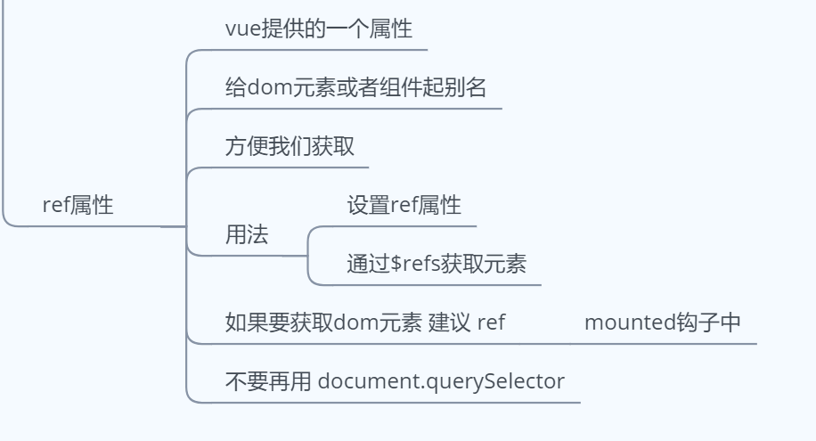

# ref

```html
<!DOCTYPE html>
<html lang="en">
  <head>
    <meta charset="UTF-8" />
    <meta name="viewport" content="width=device-width, initial-scale=1.0" />
    <meta http-equiv="X-UA-Compatible" content="ie=edge" />
    <title>Document</title>
  </head>
  <body>
    <div id="app">
      <div ref="box"></div>
      <h2 ref="title"></h2>
    </div>
  </body>
</html>
<script src="./libs/vue.js"></script>
<script>
  let app = new Vue({
    el:"#app",
    mounted() {
      console.log(this.$refs.title)
    },
  })
</script>
```



**在vue种可以获取dom元素，不用再用document.querySelector**

**$refs实在原型里**