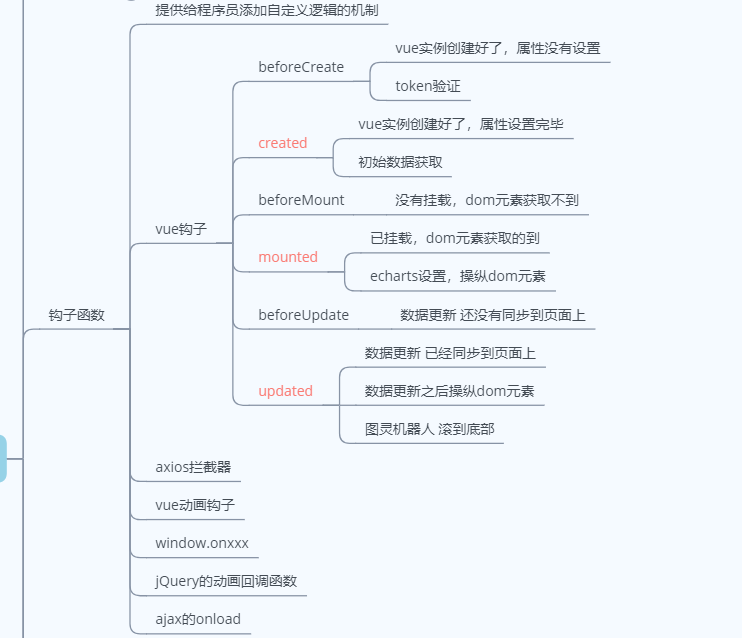

# 钩子函数

**所有的生命周期钩子自动绑定 ``this`` 上下文到实例中，因此你可以访问数据，对属性和方法进行运算。这意味着你不能使用箭头函数来定义一个生命周期方法 (例如 ``created: () => this.fetchTodos()``)。这是因为箭头函数绑定了父上下文，因此`` this ``与你期待的 Vue 实例不同，``this.fetchTodos`` 的行为未定义。**

